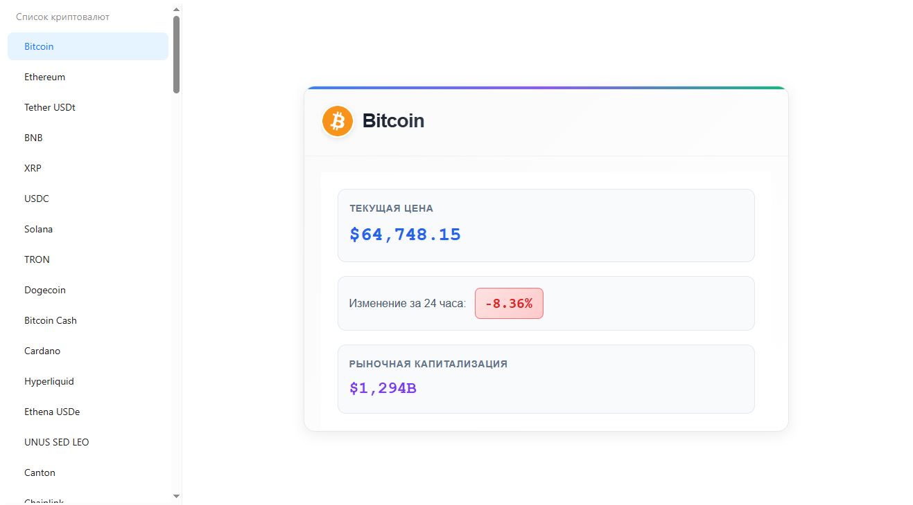

# CryptoProject

Отслеживание изменения цены криптовалюты.



## Использованный стек технологий

### Backend
- **FastAPI**, **Pydantic**, **Pydantic-Settings**, **Aiohttp**

### Frontend
- **React**, **Axios**, **Ant design**, **Tailwind**

## Установка
1. **Клонируйте репозиторий**
```bash
git clone https://github.com/reclacc/competencies-center-bot.git
```

2. **Создайте виртуальное окружение**
```bash
python -m venv venv
venv\Scripts\activate # Windows
```

3. **Установите зависимости**
```bash
cd backend
python install -r requirements.txt
```
```bash
cd frontend
npm install
```

## Настройка
1. **Конфигурация .env_example**
```bash
API_KEY__CMC_API_KEY="123"
# Сгенерируйте свой, ссылка к источнику прилагается
```
Источник: https://pro.coinmarketcap.com/login/

Документация: https://coinmarketcap.com/api/documentation/v1/

## Запуск
### Backend
Первым делом запустите backend, а только после - frontend
```bash
uvicorn main:app --reload # находясь в backend/
```
### Frontend
```bash
npm run dev # Находясь в frontend/
```
